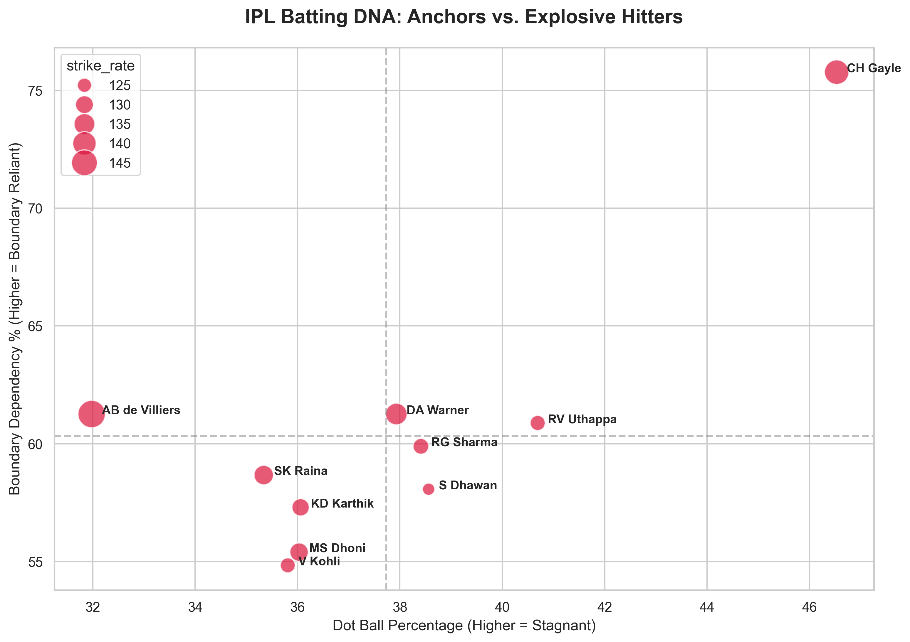

# 🏏 IPL Batting DNA: Advanced Performance Analytics

## 📌 Project Overview
Traditional cricket statistics often focus on total runs, which fails to capture a batter's true intent and risk profile. This project is a Python-based Logic Engine that ingests raw, ball-by-ball IPL data (2008-2022) to calculate advanced metrics, specifically identifying a player's "Batting DNA."

**Goal:** Differentiate "Accumulators" (low risk, high strike rotation) from "Explosive Hitters" (high risk, boundary reliant).

## 🛠️ Tech Stack
* **Python:** Core logic engine
* **Pandas:** Vectorized feature engineering and large-scale data aggregation
* **Matplotlib & Seaborn:** Data visualization and quadrant mapping

## 🧠 The Logic Engine
The script (`batting_engine.py`) processes over 200,000 individual deliveries to calculate:
1. **Boundary Dependency %:** The percentage of total runs generated purely from 4s and 6s.
2. **Dot Ball %:** The percentage of deliveries faced where zero runs were scored.
3. **True Strike Rate:** Runs per 100 balls.

## 📊 Key Insights

By mapping Dot Ball % against Boundary Dependency %, distinct player profiles emerge:
* **The Ultimate Anchor:** Virat Kohli balances a massive run aggregate with a very low dot-ball percentage (35%), relying on strike rotation rather than pure boundary hitting (54%).
* **The T20 Mercenary:** Chris Gayle represents extreme variance. He boasts the highest boundary dependency (75.7%) but offsets this with the highest dot-ball percentage (46.5%). 
* **The Perfect Balance:** AB de Villiers showcases a statistical anomaly—maintaining a massive strike rate (148+) and high boundary percentage (61%) while keeping his dot balls remarkably low (31%).
